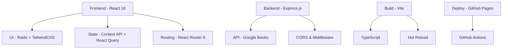

# 🔧 Documentação Técnica - Folium

## 📋 **Resumo das Tecnologias**

### **Stack Principal**



### **Arquitetura de Componentes**

```
📱 Client Application
├── 🎨 Presentation Layer
│   ├── Pages (LandingPage, Biblioteca, Perfil)
│   ├── Components (UI, Business Logic)
│   └── Styling (TailwindCSS + CSS Variables)
├── 🔄 State Management
│   ├── AuthProvider (User Context)
│   ├── BookListsProvider (Lists Context)
│   ├── ThemeProvider (Dark/Light Mode)
│   └── React Query (Server State)
├── 🛣️ Routing
│   ├── Public Routes (Landing, Login, Register)
│   ├── Protected Routes (Library, Profile)
│   └── Navigation Guards
└── 🌐 API Layer
    ├── Google Books Integration
    ├── Local Storage Persistence
    └── Error Handling
```

## 🚀 **Performance Optimizations**

### **Code Splitting**

- Lazy loading de rotas
- Componentes sob demanda
- Tree shaking automático

### **Caching Strategy**

- React Query para cache de API
- LocalStorage para persistência
- Service Worker (futuro)

### **Bundle Analysis**

```bash
# Analisar bundle size
npm run build
npx vite-bundle-analyzer dist/spa
```

## 🔒 **Segurança**

### **Frontend Security**

- Sanitização de inputs
- CSP headers (Content Security Policy)
- XSS protection via React
- Type safety com TypeScript

### **API Security**

- CORS configurado
- Rate limiting (futuro)
- Input validation
- Error handling consistente

## 📊 **Monitoramento e Analytics**

### **Performance Metrics**

- Core Web Vitals
- Time to Interactive (TTI)
- First Contentful Paint (FCP)
- Largest Contentful Paint (LCP)

### **Error Tracking**

- Console error monitoring
- User feedback collection
- Crash reporting (futuro)

## 🧪 **Testing Strategy**

### **Test Pyramid**

```
🔺 E2E Tests (Cypress/Playwright) - 10%
🔺 Integration Tests (Testing Library) - 20%
🔺 Unit Tests (Vitest) - 70%
```

### **Test Coverage Goals**

- Components: 80%+
- Utils/Hooks: 90%+
- API Layer: 85%+

## 🔄 **CI/CD Pipeline**

### **GitHub Actions Workflow**

1. **Lint & Type Check** - Qualidade de código
2. **Unit Tests** - Testes automatizados
3. **Build** - Compilação para produção
4. **Deploy** - GitHub Pages automático

### **Deployment Strategy**

- **Development**: Auto-deploy em feature branches
- **Staging**: Deploy em PR merge
- **Production**: Deploy em push para main

## 📱 **Mobile & Responsive**

### **Breakpoint Strategy**

```scss
// Mobile First Approach
$mobile: 320px;
$tablet: 768px;
$desktop: 1024px;
$wide: 1440px;
```

### **Touch Optimization**

- Botões mínimo 44px
- Swipe gestures
- Touch-friendly spacing
- Keyboard navigation

## 🔧 **Development Setup**

### **VSCode Extensions Recomendadas**

```json
{
  "recommendations": [
    "bradlc.vscode-tailwindcss",
    "esbenp.prettier-vscode",
    "ms-vscode.vscode-typescript-next",
    "bradlc.vscode-tailwindcss",
    "formulahendry.auto-rename-tag"
  ]
}
```

### **Git Hooks**

```bash
# Pre-commit hooks
npm run typecheck
npm run lint
npm run format.fix
```

## 🌐 **API Documentation**

### **Endpoints**

#### `GET /api/books/search`

Busca livros na API do Google Books

**Parameters:**

- `q` (string, required): Query de busca
- `category` (string, optional): Filtro por categoria
- `language` (string, optional): Código do idioma
- `publishedDate` (string, optional): Período de publicação
- `startIndex` (number, optional): Paginação - índice inicial
- `maxResults` (number, optional): Quantidade de resultados

**Response:**

```typescript
interface BooksResponse {
  livros: Book[];
  totalItens: number;
  paginaAtual: number;
  totalPaginas: number;
}
```

### **Error Handling**

```typescript
interface ApiError {
  error: string;
  code?: number;
  details?: string;
}
```

## 🎨 **Design System**

### **Color Tokens**

```css
:root {
  /* Light Mode - Paper Theme */
  --folium-cream: 42 25% 97%;
  --folium-parchment: 40 20% 92%;
  --folium-sage: 85 20% 65%;
  --folium-ink: 25 45% 25%;

  /* Dark Mode - Night Theme */
  --folium-midnight: 215 25% 8%;
  --folium-azure: 210 60% 75%;
  --folium-steel: 215 12% 25%;
  --folium-silver: 215 10% 35%;
}
```

### **Typography Scale**

```css
/* Headings - Crimson Text */
.font-serif {
  font-family: "Crimson Text", Georgia, serif;
}

/* Body - Inter */
.font-sans {
  font-family: "Inter", system-ui, sans-serif;
}

/* Scale */
.text-xs {
  font-size: 0.75rem;
}
.text-sm {
  font-size: 0.875rem;
}
.text-base {
  font-size: 1rem;
}
.text-lg {
  font-size: 1.125rem;
}
.text-xl {
  font-size: 1.25rem;
}
```

## 🚀 **Deployment Checklist**

### **Pre-Deploy**

- [ ] Tests passing
- [ ] Type checking clean
- [ ] Build successful
- [ ] Performance audit
- [ ] Accessibility check
- [ ] Cross-browser testing

### **Post-Deploy**

- [ ] Smoke tests
- [ ] Performance monitoring
- [ ] Error tracking
- [ ] User feedback collection

## 📈 **Future Roadmap**

### **Q1 2024**

- [ ] PWA support
- [ ] Offline functionality
- [ ] Push notifications
- [ ] Advanced search filters

### **Q2 2024**

- [ ] Social features
- [ ] Reading progress tracking
- [ ] Book recommendations
- [ ] Mobile app (React Native)

### **Q3 2024**

- [ ] AI-powered recommendations
- [ ] Reading analytics
- [ ] Multi-language support
- [ ] Third-party integrations

## 📞 **Support & Maintenance**

### **Issue Templates**

- Bug reports
- Feature requests
- Performance issues
- Documentation updates

### **Monitoring**

- Error rates < 1%
- Page load time < 3s
- Accessibility score > 90%
- SEO score > 85%
